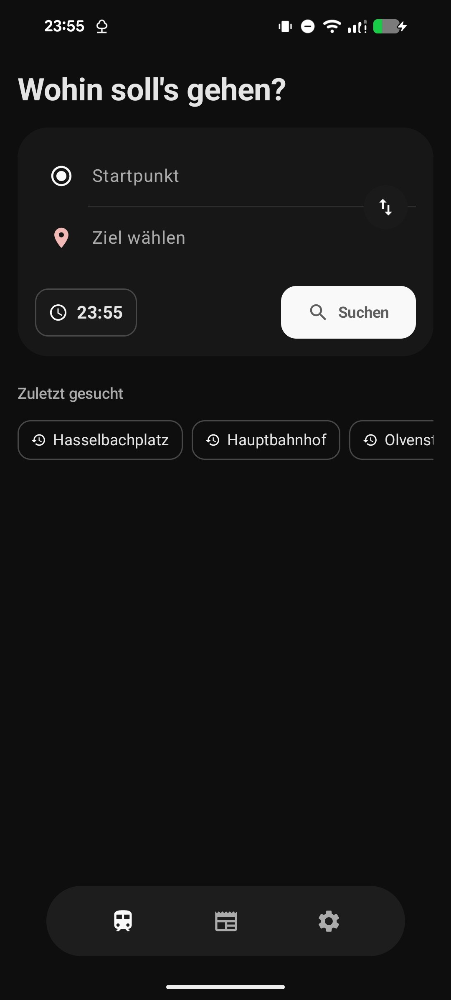
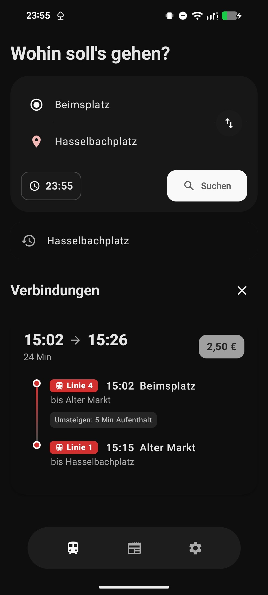
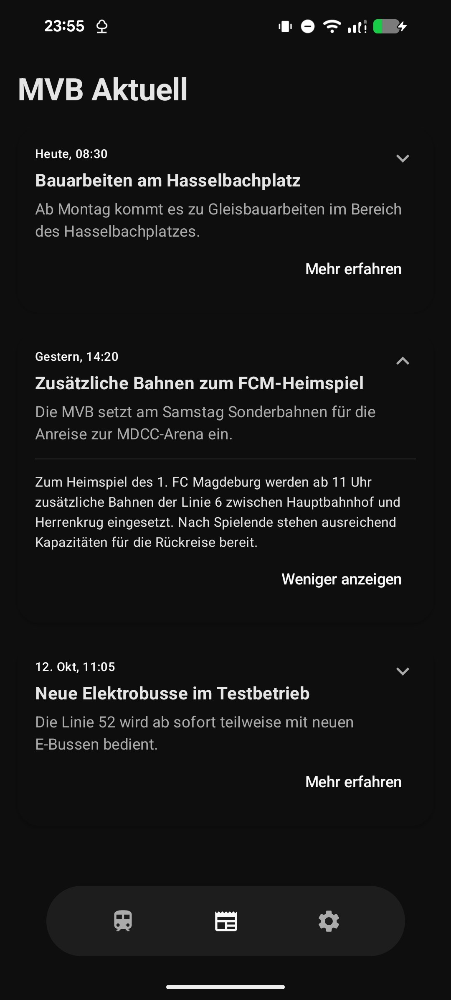

# MoveMD

MoveMD is a public transport navigation application specifically designed for the city of Magdeburg, Saxony-Anhalt. The application implements Google's Material Design 3 (Material You) guidelines to provide a modern, native, and highly accessible user experience for commuters within the regional transit network.

## Project Vision
Developed by a 14-year-old software developer based in Magdeburg, MoveMD aims to bridge the gap between complex transit data and a clean, user-centric mobile interface. The project emphasizes the practical application of modern design systems and the integration of AI-assisted development workflows.

## Technical Implementation & AI Collaboration
The codebase for MoveMD was developed with significant assistance from Google Gemini[cite: 1]. This project stands as a testament to the fact that Artificial Intelligence is a legitimate and powerful tool in modern software engineering[cite: 1]. AI was utilized for:
* Refining Material Design 3 UI components and dynamic color integration[cite: 1].
* Architectural planning and logic optimization[cite: 1].
* Rapid troubleshooting and debugging of transit API integrations[cite: 1].

## Visual Documentation

| Schedule Overview | Connection Details | News Feed |
| :---: | :---: | :---: |
|  |  |  |

## Features
* **Real-time Transit Data:** Comprehensive schedule information for the Magdeburg area[cite: 1].
* **Material Design 3:** Full support for dynamic color themes and MD3 components[cite: 1].
* **Localized Information:** Integrated news tab for local transit updates and service alerts[cite: 1].
